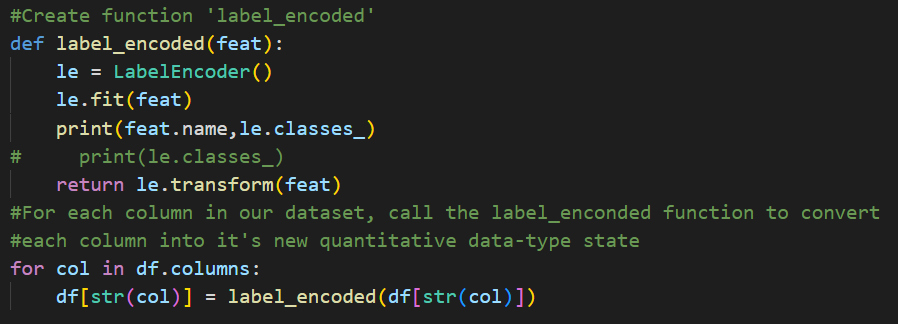
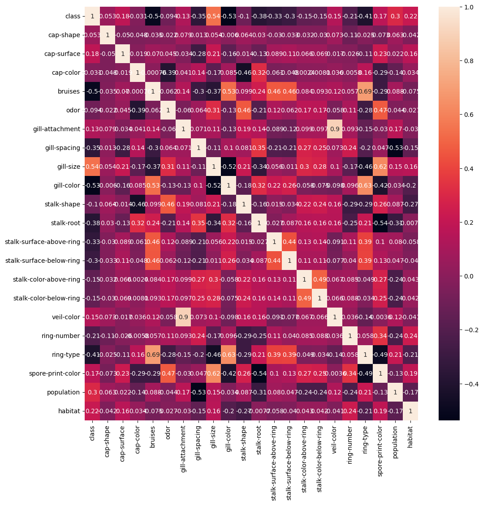

**Hi there!** - my name is Jordan and I'm a Senior Data Analyst at Salesforce. I'm currently the lead Tableau Developer for our Data Insights & Scalability team. My day typically involves developing and validating novel revenue metrics to monitor process improvement and automation efforts. Telling data stories is one of my many passions in life.

Another passion in my life is to follow a journey of continuous learning, both of myself and the world around me. I'd be happy to discuss my work experience and/or personal projects further - feel free to reach out to me on LinkedIn. My resume is also available if you'd like to know more about my education and work history.

* [LinkedIn](https://www.linkedin.com/in/jordandavis0112/)

* [Resume](https://github.com/JdGithub0112/Jordans-Portfolio/blob/main/JordanDavis_Resume_2023.pdf)

* [Tableau Portfolio](https://public.tableau.com/app/profile/jordan.davis5657#!/?newProfile=&activeTab=0)

***

## [Python Project: Mushroom Classification](https://github.com/JdGithub0112/Jordans-Portfolio/blob/main/Python%20Projects/mushroom_Classification.py)
### *Predicting whether or not a mushroom is edible or not based off of certain charecteristics: Exploratory Data Analysis and Classification*

#### *Background*
The goal of this classification Python portfolio project is to classify mushrooms as either edible or poisonous based on their physical characteristics. The project uses a dataset containing information about various physical attributes of mushrooms, such as cap shape, color, odor, and stalk shape.

The project employs various classification algorithms from the scikit-learn (sklearn) library to train and evaluate models on the mushroom dataset. The goal of the project is to build a model that can accurately classify mushrooms as either edible or poisonous based on their physical characteristics. This has important practical applications in the field of mycology and public health, as it can help people to identify dangerous or potentially harmful mushrooms in the wild. Additionally, the project serves as a good example of the application of classification algorithms in data science.

#### *Exploring and Preparing our Data for Analysis*
*Label encoding is a technique for converting categorical data into numerical data by assigning a unique numerical value to each category. This is often done in machine learning tasks to prepare the data for modeling and is useful for correlation plots as seen below.*

#### *Understand correlations, if any - present in the dataset*
*By calculating the correlation between various physical attributes, such as cap size, stalk length, or gill spacing, and the mushroom's edibility or toxicity, we can determine which attributes are most strongly predictive of whether or not a mushroom is safe to eat. This information can be used to develop a classification model that accurately predicts a mushroom's edibility based on its physical characteristics.*

#### *Building Classification model using KNN begins with creating a training and testing split (70,30)*

---

## [Python Project: COVID-19 Cases Data Analysis & Visualization](https://github.com/JdGithub0112/Jordans-Portfolio/blob/main/Python%20Projects/Covid-19_CaseData.py)
##### *Wrangling, joining, and cleaning World Health Organization Data for analysis and visualization*
##### *Leveraging Pandas and NumPy Python Libraries*
In this project I wanted to demonstrate my contempency on using Pandas for organizing and cleaning my data to end up with a dataframe for analysis. In this scenario, I wanted to learn how to scrape data from the web to have up-to-date information for my plots. The data in question comes from the World Health Organization and displays Covid cases/deaths data since early 2020 (cadence for update is everyday).

I began my explaratory data analysis by web scraping data from The [World Health Organization's website](https://covid19.who.int/data). I used the urllib library to pass through the csv data hosted on the WHO site to a csv file in my current file path where my Python script lived. I also web scraped data from the [Statistics Times Website](https://statisticstimes.com/geography/countries-by-continents.php) for country data so that I could add Continent data to my dataframe.

In oder to merge the two tables, I performed a left join on the 'Country' field alongside some general formatting to prep for the data visualization process. Lastly, I used the Seaborn library to plot New Covid-19 Cases (Moving Avg.) across the date they were reported by Continent.

