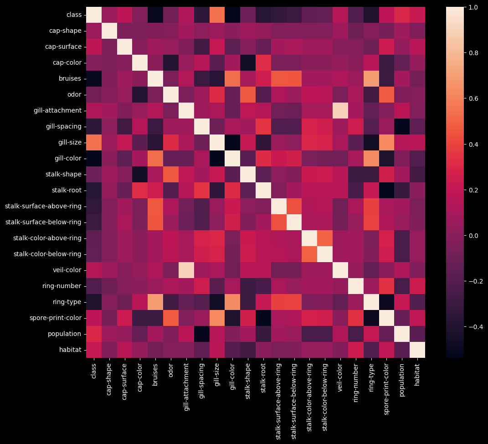

**Hi there!** - my name is Jordan and I'm a Senior Data Analyst at Salesforce. Below are a few python projects that I have worked on.

My passion in life is to follow a journey of continuous learning, both of myself and the world around me. I'd be happy to discuss my work experience and/or personal projects further - feel free to reach out to me on LinkedIn. My resume is also available if you'd like to know more about my education and work history.

* [LinkedIn](https://www.linkedin.com/in/jordandavis0112/)

* [Resume](https://github.com/JdGithub0112/Jordans-Portfolio/blob/main/JordanDavis_Resume_2023.pdf)

* [Tableau Portfolio](https://public.tableau.com/app/profile/jordan.davis5657#!/?newProfile=&activeTab=0)

***

## [Project 1 - COVID-19 Cases Data Analysis & Visualization](https://github.com/JdGithub0112/Jordans-Portfolio/blob/main/Python%20Projects/Covid-19_CaseData.py)
##### *Wrangling, joining, and cleaning World Health Organization Data for analysis and visualization*
In this project I wanted to demonstrate my contempency on using Pandas for organizing and cleaning my data to end up with a dataframe for analysis. In this scenario, I wanted to learn how to scrape data from the web to have up-to-date information for my plots. The data in question comes from the World Health Organization and displays Covid cases/deaths data since early 2020 (cadence for update is everyday).

I began my explaratory data analysis by web scraping data from The [World Health Organization's website](https://covid19.who.int/data). I used the urllib library to pass through the csv data hosted on the WHO site to a csv file in my current file path where my Python script lived. I also web scraped data from the [Statistics Times Website](https://statisticstimes.com/geography/countries-by-continents.php) for country data so that I could add Continent data to my dataframe.

In oder to merge the two tables, I performed a left join on the 'Country' field alongside some general formatting to prep for the data visualization process. Lastly, I used the Seaborn library to plot New Covid-19 Cases (Moving Avg.) across the date they were reported by Continent.

## [Project 2 - Mushroom Classification](https://github.com/JdGithub0112/Jordans-Portfolio/blob/main/Python%20Projects/mushroom_Classification.py)
##### *Exploratory Data Analysis and Classification*
In this project I performed exploratory data analysis as well as transcription of data elements to analyze correlation. The goal will be able to classify a test set of mushrooms that are either edible or not given their charecteristics.

