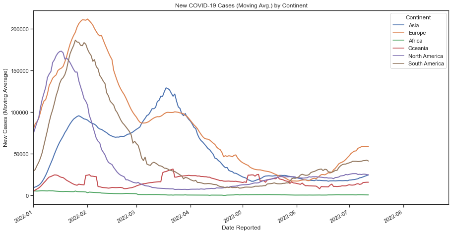
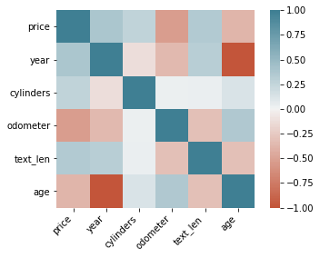

**Hey there** - my name is Jordan and I'm a Senior Analyst at Salesforce. Below are a few projects that I have worked on.

My goal is to folow a journney of learning that never ends. I'd be happy to discuss my work further - feel free to reach out to me on LinkedIn. My resume is also available if you'd like to know more about my education and work history.

* [LinkedIn](https://www.linkedin.com/in/jordandavis0112/)

* [Resume](https://github.com/JdGithub0112/Jordan-Davis---Portfolio/blob/main/JordanDavis_Resume_2022.pdf)

***

## [Project 1 - COVID-19 Cases Data Analysis & Visualization](https://github.com/JdGithub0112/Jordans-Portfolio/blob/main/pandasProject_CovidCaseData.py)
##### *Wrangling, joining, and cleaning World Health Organization Data for analysis and visualization*
In this project I wanted to demonstrate my contempency on using Pandas for organizing and cleaning my data to end up with a dataframe for analysis. In this scenario, I wanted to learn how to scrape data from the web to have up-to-date information for my plots. The data in question comes from the World Health Organization and displays Covid cases/deaths data since early 2020 (cadence for update is everyday).

I began my explaratory data analysis by web scraping data from The [World Health Organization's website](https://covid19.who.int/data). I used the urllib library to pass through the csv data hosted on the WHO site to a csv file in my current file path where my Python script lived. I also web scraped data from the [Statistics Times Website](https://statisticstimes.com/geography/countries-by-continents.php) for country data so that I could add Continent data to my dataframe.

In oder to merge the two tables, I performed a left join on the 'Country' field alongside some general formatting to prep for the data visualization process. Lastly, I used the Seaborn library to plot New Covid-19 Cases (Moving Avg.) across the date they were reported by Continent.

## [(Work in Progress) Project 2 - Predicting the Price of a Used Car on Craigslist](https://github.com/JdGithub0112/Jordans-Portfolio/blob/main/project1_LinearRegression.py)
##### *A Linear Regression approach*
In this project, I want to be able to predict the price of a used car based off of other variables such as the odometer reading, cylinders, manufacturer, and year of production. I will use the sklearn library to conduct linear regression on my data from [Kaggle](https://www.kaggle.com/datasets/austinreese/craigslist-carstrucks-data).

*In statistics, linear regression is a linear approach for modelling the relationship between a scalar response and one or more explanatory variables (also known as dependent and independent variables). - wikipedia*
